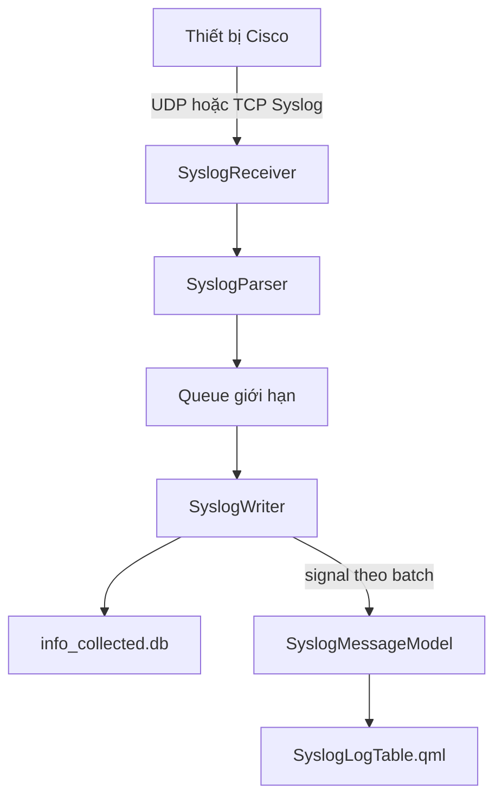

# Kế hoạch chi tiết module Syslog Server cho NetworkTools

## 1. Phạm vi và mục tiêu

Tài liệu này lập kế hoạch bổ sung một mục **Syslog Server** trên `ActivityBar` của NetworkTools, dựa trên cấu trúc nhánh `main` đã đọc tại thời điểm lập kế hoạch.

Phạm vi bản kế hoạch:

- thêm một workspace Syslog độc lập với workspace cấu hình Device hiện tại;
- chỉ hiển thị các thiết bị đang connected, tức `t01_devices.success = 1`;
- cho phép bật hoặc hủy cấu hình gửi syslog trên từng thiết bị bằng menu chuột phải;
- chạy bộ thu Syslog TCP hoặc UDP theo thiết lập của người dùng;
- parse, lưu SQLite và cập nhật giao diện gần thời gian thực;
- chia module backend và QML thành các file nhỏ, mục tiêu dưới 400 dòng/file;
- giữ nguyên hoạt động của Device, Database, Settings và các backend cũ;
- tài liệu này **không triển khai code**.

Tên chuẩn trong source nên dùng `syslog_server` thay vì thư mục có khoảng trắng `syslog sever`. Nhãn trên UI dùng **Syslog Server**.

## 2. Hiện trạng cần bám theo

Các điểm tích hợp chính đã xác nhận trong repository:

| Thành phần hiện tại | Vai trò | Ảnh hưởng khi thêm Syslog |
|---|---|---|
| `app/UI/qml/app/Main.qml` | Ghép `ActivityBar`, `PanelSideBar`, `DeviceTabs`, `FeatureBar`, `ContentArea`, `StatusBar` | Chọn workspace Syslog và thay vùng giữa bằng layout Syslog |
| `app/UI/qml/layout/ActivityBar.qml` | Quản lý `activeIndex` và `appMode` | Thêm item `appMode = "syslog"` |
| `app/UI/qml/panels/PanelSideBar.qml` | `StackLayout` cho Devices, Settings, Database | Thêm `SyslogDevicesPanel` ở một index mới |
| `app/UI/qml/panels/DevicesPanel.qml` | Hiển thị đủ connected/waiting/disconnected | Không sửa logic hiện có; không tái sử dụng trực tiếp cho Syslog |
| `app/UI/qml/sidebar/devices/DeviceContextMenu.qml` | Menu thao tác thiết bị thông thường | Giữ nguyên; Syslog dùng menu riêng chỉ có hai thao tác |
| `app/UI/qml/feature/FeatureBar.qml` | Thanh tính năng theo thiết bị | Ẩn hoàn toàn khi `appMode === "syslog"` |
| `app/UI/qml/content/ContentArea.qml` | Chuyển Devices/Settings/Database | Không nhét toàn bộ Syslog vào đây; tạo workspace Syslog riêng để giảm coupling |
| `app/main.py` | Khởi tạo backend và đăng ký QML context properties | Khởi tạo duy nhất `SyslogManager`, đóng sạch khi app thoát |
| `app/core/database_paths.py` | Đường dẫn chuẩn tới hai DB | Syslog dùng `INFO_COLLECTED_DB`, không tự suy ra path |
| `app/database/build_databases.py` | Ghép `info_collected/*.sql` và build DB | Tự nhận file SQL Syslog mới theo thứ tự tên |
| `app/database/schema/01_core_devices.sql` | `t01_devices(host TEXT PRIMARY KEY, success, ...)` | Nguồn danh sách connected |
| `app/database/schema/02_interface_router_l3.sql` | `t02_interface_name(host, interface_name, ip_address, ...)` | Tìm source interface có `ip_address = host` |

Quy ước trạng thái hiện tại của `t01_devices.success`:

| Giá trị | Trạng thái UI |
|---:|---|
| `1` | connected |
| `0` | waiting |
| `-1` | disconnected |
| `3` | bị ẩn/không dùng trong danh sách |

## 3. Quyết định kiến trúc tổng thể

### 3.1. Workspace độc lập theo `appMode`

Khi người dùng chọn icon Syslog trên Activity Bar:

- `ActivityBar.appMode` chuyển thành `"syslog"`;
- `PanelSideBar` chuyển sang `SyslogDevicesPanel`;
- `DeviceTabs` ẩn;
- `FeatureBar` ẩn;
- vùng bên phải hiển thị `SyslogWorkspace` gồm thanh điều khiển, thanh lọc và bảng log;
- `StatusBar` vẫn giữ nguyên để báo lỗi, trạng thái listener và số log nhận được.

Không thay đổi state của tab Device. Khi quay lại `appMode = "devices"`, các tab và feature đang mở phải được khôi phục như trước.

### 3.2. Luồng dữ liệu



Nguyên tắc ổn định:

- socket listener không chạy trên UI thread;
- parser không truy cập QML;
- SQLite chỉ có một writer chuyên trách cho module Syslog;
- mỗi message không mở một connection mới;
- cập nhật UI theo batch, không phát signal cho từng packet khi lưu lượng cao;
- model UI chỉ giữ một cửa sổ dữ liệu giới hạn, lịch sử đầy đủ nằm trong DB.

## 4. Layout đề xuất

Giữ nguyên `ActivityBar`, `PanelSideBar` và `StatusBar` theo hình tham chiếu. Khi ở chế độ Syslog, vùng `DeviceTab + FeatureBar + SubFeatureBar + ContentArea` được thay bằng layout sau:

```text
┌─────────────┬──────────────────────┬──────────────────────────────────────────┐
│ ActivityBar │ SyslogDevicesPanel   │ SyslogControlBar                        │
│             │                      ├──────────────────────────────────────────┤
│             │ CONNECTED DEVICES    │ SyslogFilterBar                         │
│             │ Search...            ├──────────────────────────────────────────┤
│             │                      │ SyslogLogTable                          │
│             │ ● R1  Configured     │ Time | Host | Fac/Sev | Mnemonic | Msg │
│             │ ● SW1 Not configured │                                          │
│             │                      │                                          │
├─────────────┴──────────────────────┴──────────────────────────────────────────┤
│ StatusBar: UDP 5514 • Listening • 3 connected hosts • 1,240 messages         │
└────────────────────────────────────────────────────────────────────────────────┘
```

### 4.1. `SyslogControlBar`

Chức năng:

- trạng thái `Stopped`, `Starting`, `Listening`, `Stopping`, `Error`;
- nút Start/Stop listener;
- hiển thị protocol, bind IP và port lấy từ Settings;
- nút Clear View chỉ xóa model đang xem, không xóa DB;
- nút Pause/Resume UI: listener vẫn thu và DB vẫn lưu khi UI bị pause;
- nút Export để dành cho giai đoạn sau, không bắt buộc MVP.

### 4.2. `SyslogFilterBar`

Các bộ lọc:

- host: All hoặc host đang chọn ở panel;
- severity: 0–7, hỗ trợ nhiều lựa chọn;
- facility/mnemonic;
- tìm kiếm nội dung message;
- khoảng thời gian;
- Live mode bật/tắt;
- Reset filters.

Filter text nên debounce 250–300 ms. Truy vấn lịch sử phân trang theo `id DESC`, không dùng `OFFSET` lớn; dùng keyset pagination `id < last_id`.

### 4.3. `SyslogLogTable`

Cột mặc định:

| Cột | Nội dung |
|---|---|
| Time | ưu tiên `device_time`, fallback `received_at` |
| Host | `device_host`/tên thiết bị |
| Source IP | IP socket gửi message |
| Facility | ví dụ LINK, SYS, OSPF, LINEPROTO |
| Severity | số 0–7 và nhãn Emergency…Debug |
| Mnemonic | ví dụ UPDOWN, CONFIG_I |
| Message | nội dung đã parse |

Tương tác:

- màu dòng theo severity, nhưng vẫn đảm bảo độ tương phản của theme;
- chọn dòng mở `SyslogMessageDetails` ở panel dưới hoặc dialog;
- details hiển thị device time, received time, raw message và trạng thái parse;
- mặc định nạp 200 dòng gần nhất;
- model live giữ tối đa khoảng 2.000 dòng để không tăng RAM vô hạn;
- nút Load older nạp tiếp theo keyset pagination.

## 5. PanelSideBar trong chế độ Syslog

### 5.1. Nguồn dữ liệu

Không lọc lại `dbManager.getDevices()` ở QML vì API đó trả cả ba trạng thái. Tạo API riêng trong module Syslog:

```sql
SELECT host, device_name, device_type
FROM t01_devices
WHERE success = 1
ORDER BY COALESCE(NULLIF(TRIM(device_name), ''), host) COLLATE NOCASE;
```

Mỗi item trả thêm trạng thái cấu hình Syslog từ `syslog_device_state`:

- `configured`: đã cấu hình destination tương ứng với Settings hiện tại;
- `not_configured`: chưa cấu hình;
- `busy`: đang gửi lệnh;
- `error`: lần cấu hình gần nhất thất bại.

Panel refresh khi:

- vừa mở appMode Syslog;
- thiết bị connect/disconnect;
- cấu hình/hủy cấu hình hoàn tất;
- người dùng bấm Refresh;
- timer dự phòng 5 giây nếu chưa có signal trạng thái thiết bị dùng chung.

### 5.2. Menu chuột phải

Dùng file riêng `SyslogDeviceContextMenu.qml`. Menu chỉ chứa:

1. **Syslog Server** — gửi cấu hình bật Syslog;
2. **Cancel Syslog Server** — gỡ destination Syslog do app quản lý.

Quy tắc enable:

- chỉ thao tác với host vẫn có `success = 1` tại thời điểm backend bắt đầu;
- disable `Syslog Server` khi trạng thái đang configured/busy;
- disable `Cancel Syslog Server` khi chưa configured hoặc đang busy;
- nếu Settings chưa hợp lệ hoặc listener chưa sẵn sàng, lệnh bật bị chặn và trả lỗi rõ ràng;
- double click/left click host chỉ áp bộ lọc bảng log, không mở `DeviceTabs`.

Menu `DeviceContextMenu.qml` của workspace Device được giữ nguyên. Như vậy việc thêm Syslog không làm mất Edit, Ping, CLI, Delete và các thao tác cũ.

## 6. Settings cho Syslog Server

Thêm mục `Syslog Server` vào `SettingsPanel.qml`. Nội dung form đặt trong file riêng, lưu bằng `QSettings` qua `SyslogSettings`, không ghi chung vào schema cấu hình thiết bị.

| Setting | Kiểu/giá trị | Mặc định đề xuất | Ghi chú |
|---|---|---|---|
| Enabled on startup | bool | false | Không tự mở socket nếu người dùng chưa bật |
| Protocol | UDP/TCP | UDP | Cisco Syslog thường dùng UDP |
| Bind IP | local IP | `0.0.0.0` hoặc IP chọn | Địa chỉ app lắng nghe |
| Advertised/server IP | local IPv4 | IP người dùng chọn | IP chèn vào `logging host` |
| Port | 1–65535 | 5514 | Tránh quyền root/admin; cấu hình Cisco phải kèm port |
| Trap severity | 0–7 | 4 warnings | Khớp yêu cầu `logging trap warnings` |
| Console severity | 0–7/off | 6 informational | Khớp yêu cầu mẫu |
| Add timestamp | bool | true | `service timestamps log datetime msec` |
| Retention days | số ngày | 30 | Cleanup theo batch |
| Max DB size | MiB hoặc off | 500 MiB | Hàng rào an toàn bổ sung |

Phân biệt hai IP:

- `bind_ip`: địa chỉ socket listener bind trên máy chạy app;
- `advertised_ip`: IP thiết bị mạng có thể route tới và được đưa vào lệnh Cisco.

Nếu bind `0.0.0.0`, vẫn bắt buộc chọn một `advertised_ip` cụ thể. Không được đưa `0.0.0.0` vào `logging host`.

Lưu ý port:

- port 514 là port Syslog tiêu chuẩn nhưng trên Linux thường cần quyền cao;
- mặc định 5514 giúp chạy app không cần root;
- khi dùng 5514, command generator phải thêm `transport udp port 5514` hoặc `transport tcp port 5514`.

## 7. Cấu hình thiết bị Cisco

### 7.1. Tìm source interface

Theo yêu cầu, interface nguồn là interface có IP trùng với `host`:

```sql
SELECT interface_name
FROM t02_interface_name
WHERE host = ?
  AND ip_address = ?
  AND COALESCE(shutdown, 0) = 0
ORDER BY CASE WHEN success = 1 THEN 0 ELSE 1 END, iface_id
LIMIT 1;
```

Hai tham số đều là host đang chọn. Nếu không tìm thấy đúng một interface phù hợp, backend không tự đoán interface khác; thao tác dừng và hướng dẫn người dùng đồng bộ dữ liệu Interface trước.

### 7.2. Command plan khi bật

Command generator tạo lệnh từ Settings, không hard-code trong QML:

```text
logging host <advertised_ip> transport <udp|tcp> port <port>
logging trap warnings
logging console informational
service timestamps log datetime msec
logging source-interface <interface_name>
```

Đối với IOS/IOS-XE không hỗ trợ đúng biến thể cú pháp trên, adapter theo OS chịu trách nhiệm tạo cú pháp tương thích. MVP nên hỗ trợ rõ `cisco_ios` và `cisco_xe`; OS khác trả `unsupported`, không gửi thử lệnh mù.

Trước khi gửi:

1. kiểm tra listener đang Listening;
2. kiểm tra host vẫn `success = 1`;
3. kiểm tra advertised IP/port/protocol hợp lệ;
4. tìm source interface;
5. lấy session hiện có từ session registry hoặc mở qua gateway dùng chung;
6. tạo preview command để ghi log chẩn đoán, không lưu password;
7. gửi toàn bộ command set như một task nền;
8. chỉ đánh dấu configured khi toàn bộ task thành công.

### 7.3. Command plan khi hủy

Mặc định chỉ xóa destination do app đã thêm:

```text
no logging host <advertised_ip> transport <udp|tcp> port <port>
```

Nếu IOS yêu cầu cú pháp ngắn, adapter dùng:

```text
no logging host <advertised_ip>
```

Không tự động gỡ các lệnh toàn cục sau:

- `logging trap ...`;
- `logging console ...`;
- `service timestamps ...`;
- `logging source-interface ...`.

Lý do: các lệnh này có thể đang phục vụ một syslog server khác hoặc cấu hình quản trị sẵn có. Nếu sau này muốn rollback toàn bộ, phải là lựa chọn riêng có cảnh báo.

## 8. Thiết kế database

### 8.1. Vấn đề trong SQL đầu vào

Schema được đề xuất ban đầu có:

```sql
device_id INTEGER NOT NULL,
FOREIGN KEY (device_id) REFERENCES devices(id)
```

Điều này không phù hợp với repository vì:

- bảng thiết bị thật là `t01_devices`, không phải `devices`;
- khóa chính là `host TEXT`, không có cột `id`;
- `t01_devices` nằm ở `device_network.db`, còn log nên nằm ở `info_collected.db`;
- SQLite không thực thi foreign key xuyên hai file database.

### 8.2. File SQL mới

Tạo `app/database/info_collected/12_info_syslog.sql` (số thứ tự cuối cùng phải được điều chỉnh nếu thư mục đã có file lớn hơn tại thời điểm triển khai).

Schema đích đề xuất:

```sql
PRAGMA journal_mode = WAL;

CREATE TABLE t12_syslog_messages (
    id              INTEGER PRIMARY KEY AUTOINCREMENT,
    device_host     TEXT NOT NULL,
    source_ip       TEXT NOT NULL,
    device_time     TEXT,
    received_at     TEXT NOT NULL DEFAULT CURRENT_TIMESTAMP,
    facility        TEXT,
    severity        INTEGER NOT NULL CHECK (severity BETWEEN 0 AND 7),
    mnemonic        TEXT,
    message         TEXT NOT NULL,
    raw_message     TEXT,
    protocol        TEXT NOT NULL CHECK (protocol IN ('udp', 'tcp')),
    parse_status    TEXT NOT NULL DEFAULT 'parsed'
                    CHECK (parse_status IN ('parsed', 'partial', 'raw'))
);

CREATE INDEX idx_t12_syslog_host_time
    ON t12_syslog_messages(device_host, received_at DESC);

CREATE INDEX idx_t12_syslog_severity_time
    ON t12_syslog_messages(severity, received_at DESC);

CREATE INDEX idx_t12_syslog_source_ip
    ON t12_syslog_messages(source_ip);

CREATE INDEX idx_t12_syslog_facility_time
    ON t12_syslog_messages(facility, received_at DESC);

CREATE TABLE t12_syslog_device_state (
    device_host       TEXT NOT NULL,
    server_ip         TEXT NOT NULL,
    protocol          TEXT NOT NULL CHECK (protocol IN ('udp', 'tcp')),
    port              INTEGER NOT NULL CHECK (port BETWEEN 1 AND 65535),
    source_interface  TEXT,
    configured        INTEGER NOT NULL DEFAULT 0 CHECK (configured IN (0, 1)),
    last_result       TEXT,
    updated_at        TEXT NOT NULL DEFAULT CURRENT_TIMESTAMP,
    PRIMARY KEY (device_host, server_ip, protocol, port)
);
```

`device_host` được backend kiểm tra với `device_network.db` trước khi insert. Không khai báo foreign key giả trong `info_collected.db`.

### 8.3. Chính sách ghi và dọn dữ liệu

- `PRAGMA journal_mode=WAL`, `busy_timeout` và transaction batch;
- batch tối đa 100 message hoặc flush sau 100 ms, tùy điều kiện nào đến trước;
- queue giới hạn, ví dụ 10.000 message;
- khi queue đầy: drop có đếm số lượng, báo warning; không làm treo UI hoặc tăng RAM vô hạn;
- retention cleanup chạy lúc listener khởi động và sau mỗi 24 giờ;
- xóa theo batch nhỏ để tránh lock dài;
- checkpoint WAL định kỳ, không checkpoint mỗi message;
- raw message có giới hạn độ dài, ví dụ 16 KiB/message để chống input bất thường.

Không rebuild `info_collected.db` đang có dữ liệu chỉ để thêm bảng. Repository hiện chưa có migration system; trước khi triển khai production phải bổ sung migration versioned hoặc hướng dẫn backup và rebuild rõ ràng. MVP trong môi trường phát triển có thể rebuild DB sau khi backup.

## 9. Parser và nhận dạng thiết bị

### 9.1. Định dạng hỗ trợ

Parser tách thành các lớp nhỏ:

- PRI header để lấy facility/severity chuẩn Syslog;
- RFC 3164;
- RFC 5424 ở mức cần thiết;
- Cisco mnemonic dạng `%FACILITY-SEVERITY-MNEMONIC: message`;
- timestamp Cisco có/không có milliseconds;
- fallback raw khi message không parse hoàn toàn.

Không được bỏ message chỉ vì parse lỗi. Message vẫn lưu với:

- `parse_status = 'partial'` hoặc `'raw'`;
- severity lấy từ PRI nếu có, nếu không dùng giá trị fallback được tài liệu hóa;
- `raw_message` giữ chuỗi gốc đã giới hạn kích thước.

### 9.2. Ánh xạ source IP sang host

Thứ tự ánh xạ:

1. tìm `t01_devices.host = source_ip`;
2. tìm `t02_interface_name.ip_address = source_ip` và lấy host tương ứng;
3. nếu không khớp, đánh dấu nguồn unknown trong bộ đệm chẩn đoán.

Do schema đích yêu cầu `device_host NOT NULL`, message unknown không được ghi vào bảng chính cho đến khi có chính sách rõ ràng. Khuyến nghị giai đoạn 2 cho phép `device_host NULL` hoặc dùng bảng quarantine để tránh mất log từ thiết bị chưa khai báo.

## 10. Phân bố file

### 10.1. Cây thư mục dự kiến

```text
app/
├── backend/
│   └── syslog_server/
│       ├── __init__.py
│       ├── manager.py
│       ├── settings.py
│       ├── receiver.py
│       ├── udp_receiver.py
│       ├── tcp_receiver.py
│       ├── parser.py
│       ├── cisco_parser.py
│       ├── repository.py
│       ├── writer.py
│       ├── query_service.py
│       ├── device_service.py
│       ├── configurator.py
│       ├── command_builder.py
│       ├── models.py
│       └── retention.py
├── database/
│   └── info_collected/
│       └── 12_info_syslog.sql
├── UI/
│   ├── qml/
│   │   ├── syslog/
│   │   │   ├── SyslogWorkspace.qml
│   │   │   ├── SyslogControlBar.qml
│   │   │   ├── SyslogFilterBar.qml
│   │   │   ├── SyslogLogTable.qml
│   │   │   ├── SyslogLogRow.qml
│   │   │   ├── SyslogMessageDetails.qml
│   │   │   ├── SyslogEmptyState.qml
│   │   │   └── SyslogServerSettings.qml
│   │   ├── panels/
│   │   │   └── SyslogDevicesPanel.qml
│   │   └── sidebar/syslog/
│   │       ├── SyslogDeviceItem.qml
│   │       └── SyslogDeviceContextMenu.qml
│   └── resources/activitybar/
│       └── syslog.svg
└── tests/
    └── syslog/
        ├── test_parser.py
        ├── test_repository.py
        ├── test_receiver_udp.py
        ├── test_receiver_tcp.py
        ├── test_command_builder.py
        ├── test_device_service.py
        ├── test_retention.py
        └── test_qml_syslog_smoke.py
```

### 10.2. Trách nhiệm từng file backend

| File | Trách nhiệm | Mục tiêu kích thước |
|---|---|---:|
| `__init__.py` | Chỉ export API công khai | < 50 dòng |
| `manager.py` | QObject facade cho QML; lifecycle; signals/slots; không chứa SQL/parser | 250–350 |
| `settings.py` | `SyslogSettings`, validation, QSettings properties | 150–250 |
| `receiver.py` | Interface/lifecycle chung và state machine | 150–220 |
| `udp_receiver.py` | Socket UDP, timeout, datagram intake | 120–200 |
| `tcp_receiver.py` | TCP accept/client lifecycle, framing, giới hạn client | 180–280 |
| `parser.py` | PRI/RFC parser và điều phối parser | 200–300 |
| `cisco_parser.py` | Cisco timestamp/facility/severity/mnemonic | 150–250 |
| `models.py` | Dataclass DTO, enum severity/state | 100–180 |
| `repository.py` | Connection helper, insert batch, state table | 220–320 |
| `writer.py` | Queue consumer, batch transaction, signal batch | 150–250 |
| `query_service.py` | Filter validation và truy vấn phân trang | 180–280 |
| `device_service.py` | Connected hosts, source-interface lookup, source-IP mapping | 180–260 |
| `configurator.py` | Task nền bật/hủy cấu hình qua session dùng chung | 220–320 |
| `command_builder.py` | Adapter command Cisco IOS/IOS-XE, không I/O | 150–250 |
| `retention.py` | Cleanup theo ngày/kích thước, WAL checkpoint | 120–200 |

### 10.3. Trách nhiệm từng file QML

| File | Trách nhiệm | Mục tiêu kích thước |
|---|---|---:|
| `SyslogWorkspace.qml` | Ghép ba vùng chính, wiring signal, không chứa delegate dài | 180–260 |
| `SyslogControlBar.qml` | Start/Stop/Pause/Clear và status listener | 150–230 |
| `SyslogFilterBar.qml` | Host/severity/search/time/live filters | 220–320 |
| `SyslogLogTable.qml` | Header, ListView/TableView, pagination | 250–350 |
| `SyslogLogRow.qml` | Một dòng log và màu severity | 120–200 |
| `SyslogMessageDetails.qml` | Chi tiết message/raw | 150–240 |
| `SyslogEmptyState.qml` | Trạng thái chưa chạy/chưa có log/lỗi | < 120 |
| `SyslogServerSettings.qml` | Form Settings và validation hiển thị | 250–350 |
| `SyslogDevicesPanel.qml` | Search, connected list, refresh, chọn filter | 220–320 |
| `SyslogDeviceItem.qml` | Item host và badge configured | 120–200 |
| `SyslogDeviceContextMenu.qml` | Hai action bật/hủy | < 180 |

Nếu file vượt 400 dòng vì nhiều trách nhiệm, bắt buộc tách. Ngoại lệ chỉ chấp nhận với file khai báo dữ liệu tĩnh hoặc generated file và phải ghi chú trong review.

## 11. Các file cũ được phép sửa tối thiểu

| File liên kết | Thay đổi dự kiến |
|---|---|
| `app/main.py` | Khởi tạo `SyslogManager`; context property `syslogManager`; nối `aboutToQuit` tới shutdown |
| `app/UI/qml/layout/ActivityBar.qml` | Thêm icon Syslog và `handleItemClick(..., "syslog")` |
| `app/UI/qml/app/Main.qml` | Chọn hiển thị Device workspace hoặc `SyslogWorkspace`; truyền appMode; giữ state Device |
| `app/UI/qml/panels/PanelSideBar.qml` | Thêm index và proxy signal cho `SyslogDevicesPanel` |
| `app/UI/qml/panels/SettingsPanel.qml` | Thêm item `syslog_server` |
| `app/UI/qml/content/SettingsView.qml` | Lazy-load `SyslogServerSettings` |
| `app/UI/qmldir` | Đăng ký các component QML mới |
| `app/database/info_collected.sql` | Output generated bởi builder, không sửa tay |

Không thêm code Syslog trực tiếp vào `app/core/database.py`. Module mới dùng repository riêng và đường dẫn chuẩn từ `core/database_paths.py`. Điều này tránh làm file database cũ lớn hơn và giảm nguy cơ ảnh hưởng Routing/DHCP/ACL/NAT.

## 12. API giữa QML và backend

QML chỉ gọi facade `syslogManager`. API dự kiến:

### Properties/signals

- `listenerState`, `listenerMessage`;
- `protocol`, `bindIp`, `advertisedIp`, `port`;
- `receivedCount`, `droppedCount`, `queueDepth`;
- `connectedDevicesChanged(devices)`;
- `messagesInserted(batch)`;
- `queryFinished(requestId, rows, hasMore)`;
- `deviceConfigStarted(host, action)`;
- `deviceConfigFinished(host, action, ok, message)`;
- `fatalError(message)`.

### Slots

- `startServer()` / `stopServer()`;
- `loadConnectedDevices()`;
- `configureDevice(host)`;
- `cancelDevice(host)`;
- `queryMessages(filters, beforeId, limit)`;
- `clearView()` chỉ tác động model;
- `deleteMessages(filters)` chỉ thêm sau khi có dialog xác nhận rõ ràng.

Mọi slot network/DB lâu phải bất đồng bộ. Slot QML không chờ socket, SSH hoặc truy vấn lớn.

## 13. Threading và lifecycle

### Startup

1. `build_missing_databases()` chạy như hiện tại;
2. tạo `QApplication`/engine;
3. tạo `SyslogManager` nhưng chưa bind socket nếu setting auto-start = false;
4. đăng ký context property;
5. QML load bình thường;
6. chỉ load `SyslogWorkspace` khi người dùng mở Syslog lần đầu.

### Runtime

- receiver thread chỉ nhận bytes và đưa vào queue;
- writer thread parse hoặc nhận DTO đã parse, ghi batch;
- query chạy ở worker riêng hoặc task thread ngắn;
- QML model chỉ thay đổi trên GUI thread;
- Stop chuyển state tuần tự `Listening → Stopping → Stopped`.

### Shutdown

Thứ tự bắt buộc:

1. ngừng nhận connection/datagram mới;
2. đóng TCP clients;
3. flush queue còn lại với timeout hữu hạn;
4. commit và đóng SQLite connection;
5. dừng/join worker thread;
6. sau đó mới để QApplication thoát.

Nếu flush hết không kịp, báo số message chưa ghi vào stderr/log chẩn đoán; không treo vô hạn lúc thoát.

## 14. An toàn và giới hạn tài nguyên

- không chạy app bằng root chỉ để bind 514;
- validate bind/advertised IP bằng `ipaddress`;
- giới hạn TCP clients, ví dụ 64;
- TCP idle timeout và max frame size;
- UDP datagram lớn hơn giới hạn bị truncate/drop có counter;
- không render trực tiếp chuỗi điều khiển không an toàn;
- không ghi username/password hoặc session secret vào raw log;
- prepared SQL cho toàn bộ filter, tuyệt đối không nối text filter vào SQL;
- database errors không làm chết listener: retry có backoff và báo degraded state;
- khi disk full, stop writer có kiểm soát, tăng dropped counter và hiện cảnh báo nổi bật.

## 15. Kế hoạch kiểm thử

### 15.1. Unit test

- parse Cisco `%LINK-3-UPDOWN`, `%SYS-5-CONFIG_I`, `%LINEPROTO-5-UPDOWN`;
- parse PRI/RFC3164/RFC5424;
- timestamp có/không có milliseconds và timezone;
- malformed/oversized message vẫn an toàn;
- command UDP/TCP, port 514/5514, IOS/IOS-XE;
- source-interface đúng khi `ip_address = host`;
- host `success != 1` bị từ chối cấu hình;
- repository insert batch, filter, pagination, retention;
- state configured idempotent, cancel idempotent.

### 15.2. Integration test

- gửi 10.000 UDP messages, kiểm tra không block UI và không mất ngoài ngưỡng cho phép;
- nhiều TCP clients, reconnect và partial frames;
- listener Stop/Start nhiều lần không báo port already in use;
- SQLite WAL hoạt động khi UI vừa query vừa writer ghi;
- đổi Settings khi server đang chạy: yêu cầu Stop/Restart rõ ràng;
- app đóng khi queue còn dữ liệu;
- device disconnect trong khi đang configure/cancel.

### 15.3. QML smoke/regression

- `UI/Main` load không warning/error mới;
- Device workspace vẫn mở tab, FeatureBar và các form cũ;
- Settings/Database vẫn hoạt động;
- chuyển Devices → Syslog → Devices giữ tab và feature cũ;
- Syslog panel chỉ hiện `success = 1`;
- menu Syslog chỉ có hai action;
- theme light/dark/high contrast;
- cửa sổ nhỏ, sidebar resize/hide bằng Ctrl+B;
- listener chưa bật vẫn mở UI an toàn.

### 15.4. Kiểm tra database

```text
PRAGMA integrity_check;      → ok
PRAGMA foreign_key_check;   → không có row
```

Kiểm tra index bằng `EXPLAIN QUERY PLAN` cho truy vấn host + time, severity + time và source IP.

## 16. Trình tự triển khai đề xuất

### Giai đoạn 0 — Baseline

- backup hai DB;
- chạy test hiện có và lưu kết quả baseline;
- xác nhận nhánh làm việc sạch;
- chụp QML warnings hiện tại để phân biệt lỗi cũ/lỗi mới.

### Giai đoạn 1 — Schema và repository

- thêm SQL module;
- build DB test riêng;
- viết repository/query/retention tests;
- chưa liên kết QML, chưa mở socket.

### Giai đoạn 2 — Receiver và parser

- UDP trước, TCP sau;
- queue giới hạn + batch writer;
- test tải và shutdown;
- xác nhận raw fallback.

### Giai đoạn 3 — Backend facade và Settings

- `SyslogSettings`;
- `SyslogManager` lifecycle;
- đăng ký context property;
- chỉ tạo listener khi người dùng yêu cầu.

### Giai đoạn 4 — UI đọc log

- Activity Bar item;
- workspace, toolbar, filter, table, details;
- connected-only panel;
- live batch update + historical pagination.

### Giai đoạn 5 — Cấu hình thiết bị

- source-interface resolver;
- command adapter IOS/IOS-XE;
- menu hai action;
- async configure/cancel;
- state và thông báo lỗi.

### Giai đoạn 6 — Hardening và regression

- UDP/TCP load test;
- disk full/DB locked/port occupied;
- shutdown test;
- QML smoke test;
- toàn bộ test cũ của Device/Routing/DHCP/ACL/NAT;
- kiểm tra Windows và Fedora.

Mỗi giai đoạn là một commit/PR nhỏ có thể revert độc lập. Không gộp schema, receiver, UI và cấu hình Cisco vào một commit lớn.

## 17. Tiêu chí hoàn thành

Module chỉ được coi là hoàn thành khi:

- app khởi động bình thường dù Syslog chưa từng được cấu hình;
- icon Syslog mở đúng workspace;
- sidebar Syslog chỉ hiện host `success = 1`;
- menu chuột phải đúng hai lựa chọn;
- bật/cancel không block UI và có kết quả rõ ràng;
- UDP và TCP hoạt động theo Settings;
- source interface lấy đúng interface có IP trùng host;
- message được lưu và hiện gần thời gian thực;
- filter/pagination không tải toàn bộ DB vào RAM;
- Stop/Start và app shutdown không để thread/socket/DB handle treo;
- file mới tuân theo module boundary, phần lớn dưới 400 dòng;
- không làm thay đổi hành vi của các chức năng cũ;
- test mới và test hồi quy đều đạt;
- có hướng dẫn backup/nâng schema cho `info_collected.db` đang tồn tại.

## 18. Các quyết định cần khóa trước khi bắt đầu code

1. MVP chỉ hỗ trợ Cisco IOS/IOS-XE hay thêm NX-OS ngay từ đầu?
2. Chọn port mặc định 5514 hay yêu cầu người dùng tự chọn 514/5514?
3. Có lưu log từ source IP chưa map được hay chỉ cảnh báo/drop?
4. Retention mặc định 30 ngày và 500 MiB có phù hợp không?
5. Khi cancel, giữ các lệnh global như kế hoạch hay cung cấp tùy chọn rollback toàn bộ?
6. Database người dùng hiện tại sẽ rebuild sau backup hay cần xây migration versioned trước?

Khuyến nghị cho MVP: IOS/IOS-XE, UDP 5514, giữ global commands khi cancel, retention 30 ngày/500 MiB, cho phép lưu nguồn unknown bằng schema nullable hoặc quarantine, và bổ sung migration tối thiểu trước khi phát hành cho người dùng có DB hiện hữu.

---

Tài liệu kế hoạch này dựa trên layout tham chiếu và cấu trúc thực tế của `ntdatphu/NetworkTools` nhánh `main`, đặc biệt là `Main.qml`, `ActivityBar.qml`, `PanelSideBar.qml`, `DevicesPanel.qml`, `DeviceContextMenu.qml`, `ContentArea.qml`, `main.py`, `database_paths.py`, `build_databases.py`, `01_core_devices.sql` và `02_interface_router_l3.sql`.
