<!-- markdownlint-disable MD033 MD041 -->
[English](README.en.md) | [Tiếng Việt](README.md)
<div align="center">
  

  

  <p><strong>A desktop platform for centralized network device management, configuration, and monitoring.</strong></p>

  <p>
    
    
    
    
  </p>
</div>


## Overview

NetworkTools provides a unified interface for managing device inventory, tracking status, and building configurations for routers, switches, and network services. The application combines a Qt Quick/QML interface with a Python backend, stores data locally in SQLite, and communicates with devices over SSH.

The project is developed as part of a research initiative:

> Researching and building a centralized management system for automated network configuration and security monitoring.

## Key Features

| Feature area | Capabilities |
| --- | --- |
| Device management | Add, edit, delete, bulk import, ping, and concurrently connect/sync multiple hosts |
| Network configuration | DHCP, ACL, NAT, Router Interface View & Push, static routes, OSPF, and EIGRP |
| Switching | Switchport management, VLANs, SVI/L3, and switch status monitoring |
| Terminal & sessions | Open a CLI, manage session lifecycle, and run commands on devices |
| Configuration backup | Store running-config history per device using Dulwich |
| System Logs | Receive, filter, and store Syslog messages over UDP/TCP |
| Device Logs | Capture and analyze traffic with TShark in a permission-scoped environment |
| SFTP | Browse files, upload/download, and track the file transfer queue |
| External tools | Integration with SSH clients, terminal emulators, and an SQLite browser on the user's machine |
| Reporting | Source code and build workflow for the scientific report, written in LaTeX |

> Some configuration workflows depend on the vendor, protocol, and lab device involved. Always preview commands and test in dev-mode before pushing configuration to a real device.

## System Requirements

- Python **3.11 or later**;
- [`uv`](https://docs.astral.sh/uv/) for environment and dependency management;
- Windows is the primary development platform; Linux requires the corresponding Qt libraries to be fully installed;
- TShark/Wireshark if using the Device Logs feature;
- TeX Live or MiKTeX if compiling the LaTeX report;
- valid access credentials to network devices when using real connections.

## Quick Start

### 1. Get the source code

```bash
git clone https://github.com/ntdatphu/NetworkTools.git
cd NetworkTools/app
```

### 2. Run the application

```bash
uv run main.py
```

This is the only command required. `uv` creates the environment from `app/pyproject.toml` and `app/uv.lock`; the application creates new databases or restores missing schema objects without deleting existing data. Runtime data is stored by default in `app/data/`; you can set `NETWORKTOOLS_DATA_DIR` to use a different location.

## Usage Guide

### Adding and connecting a device

1. Open the **Devices** area and select **Add Device**, or press `Ctrl+N`.
2. Enter the host address, protocol, port, login credentials, operating system, and device role.
3. Save the device; its initial status will be `Waiting`/`Pending`.
4. Open the device's context menu to **Ping**, **Connect**, **Reconnect**, view the **Running Config**, or open the **CLI**.
   Use **Connect All Waiting** from the group menu to start independent host
   connection tasks concurrently.
5. Only store credentials used in your lab environment, and never commit the runtime database to Git.

### Testing with dev-mode

1. Add a mock device using lab information.
2. Once the device is in the `Waiting` state, select **Up (Dev)**.
3. Create or edit a local configuration.
4. Use **View & Push** to preview the result before applying it to a real device.

Dev-mode currently works best with Routing and DHCP; it should not be treated as the only safeguard for every feature.

### Building and deploying a configuration

1. Select an active device.
2. Open the feature you want to configure: Routing, DHCP, ACL, NAT, Interface, or Switching.
3. Enter the data and save the configuration locally.
4. Review the preview, target host, vendor, and protocol.
5. Back up the running-config before selecting **Push**.
6. Monitor the task status and re-verify the configuration on the device once it completes.

Router Interface View & Push supports Cisco IOS over SSH/Telnet for IPv4
addressing, secondary addresses, L3 tuning, WAN, and Tunnel profiles. PPP
passwords are redacted from previews and reports, and database rows are marked
applied only after the device accepts the command batch. RESTCONF/NETCONF, IPv6,
post-push verification, and automatic rollback are not integrated yet; see
[`app/features/interfaces/README.md`](app/features/interfaces/README.md).

### Syslog, Device Logs, and SFTP

- **System Logs:** configure the listener under **Settings → System Logs**, verify the bind address/port, then start the listener from the Activity Bar.
- **Device Logs:** choose the capture interface and filters before capturing packets; only use this on networks you are authorized to monitor.
- **SFTP:** verify the server's SHA-256 fingerprint before accepting the connection and transferring files.

Detailed instructions for each screen are available in [docs/USAGE_GUIDE.md](docs/USAGE_GUIDE.md). The list of keyboard shortcuts is in [docs/SHORTCUTS.md](docs/SHORTCUTS.md).

## Architecture

```text
QML / Qt Quick
      │
      ▼
Core facade & context properties
      │
      ▼
Feature services / repositories / workers
      │
      ├── SQLite
      └── Network adapters ──► Devices
```

| Path | Role |
| --- | --- |
| `app/UI/` | QML modules, layouts, components, themes, and UI assets |
| `app/core/` | Facade and shared contracts between Python and QML |
| `app/features/` | Business logic organized by feature |
| `app/infrastructure/` | Database, system, and network connection adapters |
| `app/scripts/` | Database build tooling and structure validation |
| `app/tests/` | Unit, integration, and QML smoke tests |
| `backend/` | Worker and network integration code still being standardized |
| `docs/` | Usage, architecture, and technical convention documentation |
| `latex/` | Source code for the research report |

Read more in [System Architecture](docs/ARCHITECTURE.md) and [Project Structure](docs/PROJECT_STRUCTURE.md).

## Testing and Quality Checks

Run the following commands from the `app/` directory:

```bash
uv run python scripts/validate_structure.py
uv run python -m compileall .
uv run python -m unittest discover -s tests -v
```

Runtime databases, logs, caches, credentials, private keys, and local backups must not be committed.

## Compiling the LaTeX Report

On PowerShell:

```powershell
cd latex
.\build.ps1
```

Clean up intermediate files:

```powershell
.\build.ps1 -Clean
```

## Documentation

- [Usage Guide](docs/USAGE_GUIDE.md)
- [Technical Architecture](docs/ARCHITECTURE.md)
- [Directory Structure](docs/PROJECT_STRUCTURE.md)
- [Database Schema](docs/DATABASE_SCHEMA.md)
- [UI Components](docs/UI_COMPONENTS.md)
- [System Logs](docs/SYSTEM_LOGS.md)
- [Shortcuts](docs/SHORTCUTS.md)
- [Code Audit Report](docs/CODE_AUDIT.md)
- [Changelog](CHANGELOG.md)
- [Roadmap](ROADMAP.md)
- [Contributing Guide](CONTRIBUTING.md)
- [Coding Standards](docs/CODING_STANDARDS.md)
- [Authors and Research Contributors](AUTHORS.md)

## Operational Safety

- Only connect to, capture packets from, and change the configuration of systems you are authorized to access.
- Never place passwords in command-line arguments, logs, screenshots, or commits.
- Always back up configurations and databases before rebuilding or pushing.
- Verify the target device, preview content, and dev-mode status before every deployment action.
- Do not expose the API, Syslog listener, or database to a public network without proper authentication and access control in place.

## Project Status

NetworkTools is currently in development and undergoing verification in a research/lab environment. The API, some backend workers, and some View & Push flows are still being finalized; it should not be used as a production system without integration testing on the target infrastructure.
